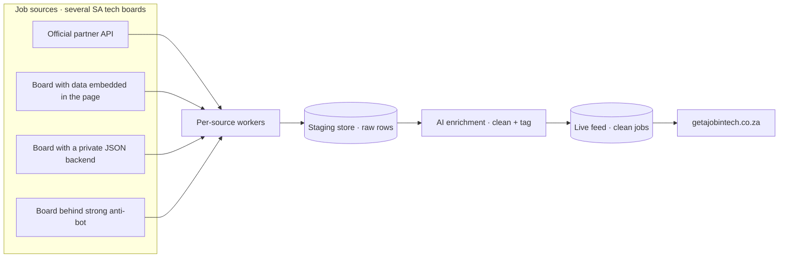
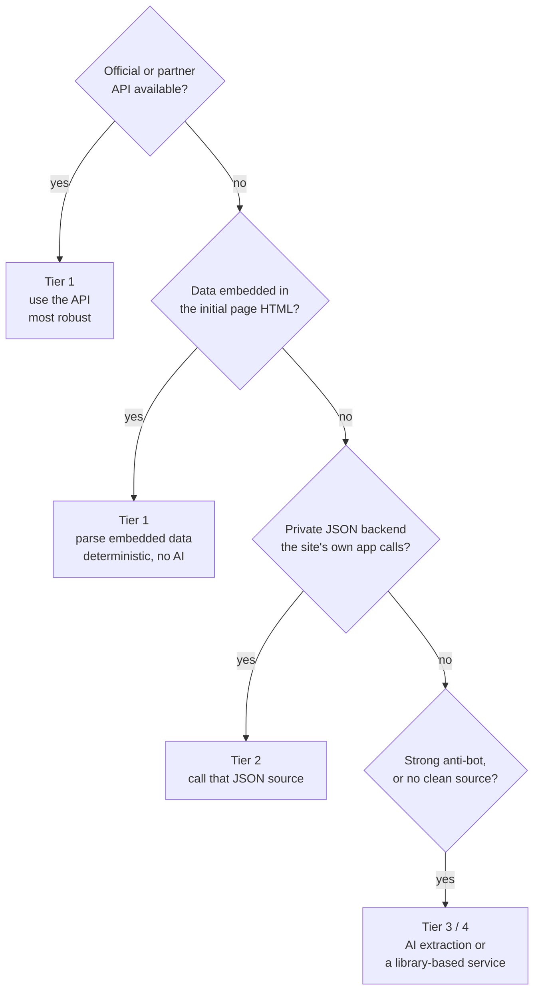
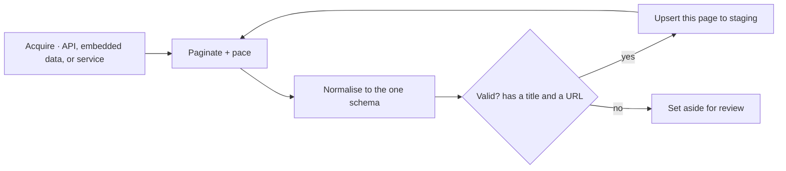
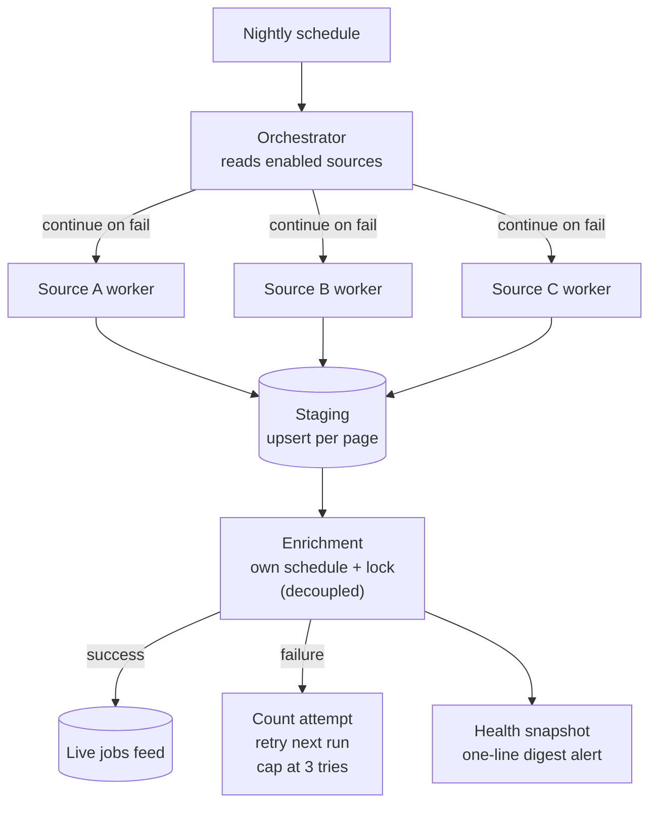
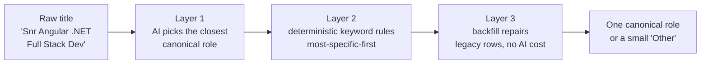

# Job aggregation pipeline ✦ a case study

This is the data pipeline behind [getajobintech.co.za](https://getajobintech.co.za), a
South African tech job board. It collects listings from several job boards every night,
cleans and tags them with AI, and publishes one deduplicated feed the website can trust.

I'm writing this for fellow engineers and hiring managers, not as a setup guide. It
explains the problem, the shape of the system, the decisions I made, and the trade-offs
I weighed. Diagrams carry the structure; prose explains the *why*.

> **Scope note.** This document deliberately abstracts the specific sources, vendors, and
> endpoints. It's a design write-up, not a runbook ✦ the goal is to show the thinking.

---

## The problem: scraping that quietly rots

Job boards change their markup, block datacentre traffic, and rate-limit aggressively. My
first version was a single Python job on a scheduler. It worked until it didn't, and the
failures were the expensive kind: silent and total.

Three failure modes drove the rebuild:

- **datacentre traffic gets blocked:** running from shared cloud IPs with a stale TLS
  fingerprint triggered bot walls and bans
- **brittle parsing breaks on layout change:** guessing fields by line position meant any
  redesign silently corrupted the data
- **all-or-nothing runs lose everything:** one big batch with a late failure threw away a
  whole night's work

| Old approach | What it cost | New approach |
|---|---|---|
| Datacentre IPs, fixed fingerprint | Blocks and bans | Residential-proxy anti-bot layer, used only when needed |
| Position-based HTML parsing | Corrupt data on redesign | Structured data first, AI extraction for the messy rest |
| One monolithic batch | Total loss on any failure | Per-source isolation, save-as-you-go |

---

## System at a glance

The pipeline is a nightly ETL flow: extract from many sources, transform with AI, load one
clean feed. Each stage is decoupled so a problem in one never cascades into the next.

> **Diagram ✦ the end-to-end path.** Several job boards feed per-source workers, which land
> raw rows in a staging store. A separate AI step cleans and tags them, then publishes to
> the live feed the website reads.

The orchestration runs on n8n, a workflow engine, with a managed Postgres database as the
store. Everything else ✦ the proxy layer, the AI provider, the extraction service ✦ is
swappable behind a clear boundary.

---

## Design principles and key decisions

### Prefer a site's own structured data; use AI only for the mess

The most robust way to read a site is the way the site reads itself. So for every source I
look for structured data before reaching for a scraper. Only genuinely messy HTML gets the
AI-extraction treatment, validated against a fixed schema.

This ordering is the single most important design choice. It minimises the surface that
can break: a structured feed survives a visual redesign, while a brittle parser does not.

> **Diagram ✦ choosing an acquisition method.** Work down the tiers and stop at the first
> one a source supports. The higher the tier, the more robust and the cheaper to maintain.

### Separate how you fetch from how you read

A subtle but load-bearing decision: **transport** (getting the bytes) and **extraction**
(reading the fields) are independent choices. A source can fetch over plain HTTP today and
switch to the proxy layer tomorrow without touching the parser.

This separation means anti-blocking is a config flip, not a rewrite. When a source starts
blocking the host, I reroute its fetch through the residential-proxy layer and the
extraction logic stays exactly the same.

### Normalise everything to one schema

Every source, however it's acquired, produces rows in one unified schema of about 30
fields ✦ title, company, location, salary, remote policy, and so on. A canonical job URL is
the required deduplication key, so re-scraping a listing updates it rather than duplicating
it.

One contract for all sources keeps the rest of the system simple. The enrichment step and
the website never need to know or care where a row came from.

### One reusable contract per source

Adding a board is deliberately cheap: one config row plus one small worker that follows a
shared five-step contract. New sources inherit all the resilience guarantees for free.

> **Diagram ✦ the contract every source worker follows.** Acquire a page, pace the request,
> normalise to the schema, validate, then save that page before moving on. Invalid rows are
> set aside rather than dropped.

---

## Resilience and trade-offs

The guiding rule: **finished work must always be durable, and no source can break
another.** Several patterns enforce that.

- **per-source isolation:** the orchestrator runs each source in its own worker and
  continues past any failure, so one crash is logged and skipped
- **save-as-you-go:** every page is written to staging *before* the next page is fetched, so
  a mid-run crash keeps everything collected so far
- **resumable runs:** lightweight checkpoints record how far each source got, so an
  interrupted run picks up where it stopped
- **decoupled enrichment:** the AI step reads from the database on its own schedule, so a
  scraping failure never blocks enrichment and vice versa
- **retry with a cap:** a failed AI call increments an attempt counter without marking the
  row done, so it retries next run and gives up after three tries instead of looping forever
- **a single-run lock:** the enrichment schedule takes a lock with a stale timeout, so
  overlapping ticks can't double-process or corrupt state

> **Diagram ✦ how isolation and decoupling protect the work.** The orchestrator fans out to
> independent workers that save per page. Enrichment runs on its own clock, retries
> failures, and emits a health snapshot every run.

### Polite by default

Scraping responsibly is both an ethics choice and a survival strategy. Each source runs
with randomised delays, single-domain concurrency, and long pauses between batches. On
repeated rate-limit responses a source circuit-breaks for the night rather than hammering
into a ban.

### An observability snapshot, not just logs

A silently broken source used to look identical to a quiet night. Now every enrichment run
writes one health record ✦ rows processed, backlog size, sources succeeded versus failed ✦
and posts a one-line digest to a chat channel. A green run and a degraded run are now
visibly different.

### Decided against (the roads not taken)

The trade-offs I'm most deliberate about are the things I chose *not* to build:

- **a low-coverage board:** evaluated and rejected ✦ HTML-only with no structured data, and
  it returned roughly 0.3% of another board's coverage for the same query at meaningful
  monthly proxy cost. Not worth the maintenance
- **a high-profile professional network:** deferred, not built ✦ high Terms-of-Service and
  block risk meant the downside outweighed the marginal listings
- **framework-specific search terms:** dropped from the query set after they pulled noise
  with no matching place to file the results

The pattern: I optimise for coverage per unit of fragility, not raw source count.

---

## AI enrichment and the role model

Raw job titles are chaos ✦ *"Senior Angular Full Stack DOTNET Developer"*, *"1st-line
Support Tech"*, *"Cyber Security Specialist"*. The website needs clean buckets to build
landing pages and trend charts. So enrichment collapses every title onto a small fixed set
of canonical roles, around two dozen of them, with a deliberately small *Other* bucket for
genuine non-tech roles.

The collapse runs in three layers, each a safety net for the one before:

> **Diagram ✦ collapsing a messy title into a canonical role.** An AI pass proposes the
> closest role, deterministic rules correct it, and a backfill repairs older rows. The
> output is always one canonical role or a small *Other* bucket.

Why three layers? The AI is good at semantics but not reliable enough to trust alone. The
deterministic rules are the source of truth for new rows and catch the AI's mistakes ✦
testing the most specific patterns first so a full-stack role never gets filed as frontend.
The backfill repairs historical rows for free, with no AI calls.

The hard-won lesson: a free-text role field let *"Other"* become the single largest
category on the board, which polluted the trend pages. Forcing every title through a fixed
list fixed that at the root.

---

## What's next and current scope

Honest current state and near-term direction:

- **live sources:** several boards across the tiers ✦ official API, embedded data, private
  JSON, and a library-based service ✦ feed the pipeline today
- **deferred:** the high-risk professional network, pending a safer acquisition path
- **next:** richer salary normalisation and a backfill mode for deep historical coverage

### How I keep the docs honest

One small workflow detail I'm proud of, because it reflects how I work: an automated guard
blocks a coding session from ending if pipeline behaviour changed but the docs didn't. It's
a forcing function against the most common documentation failure ✦ drift between what the
system does and what the docs claim.

---

*Owner: Jess Klette · Last reviewed: 2026-06-24 · Review cadence: when the architecture
changes materially. This is a public case study; the internal build docs live separately.*